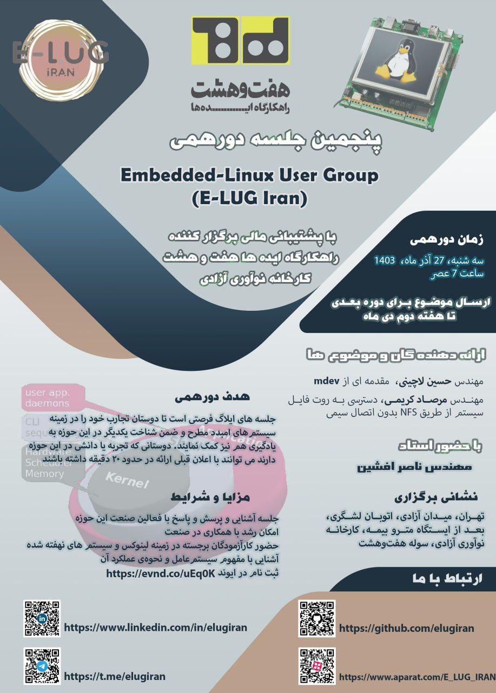

### E-LUG 1403-09

| Title  | Speaker | Slides | Video |
| ------------- | ------------- | ------------- | ------------- |
| Introduction to mdev | [Hossein Lachini](https://github.com/HosseinLachini) | [PDF](events/1403/09/documents/E-LUG-mdev.pdf) - [PPTX](events/1403/09/documents/E-LUG-mdev.pptx) | [Youtube](https://www.youtube.com/@E-LUG_IRAN) - [Aparat](https://www.aparat.com/E_LUG_IRAN) |
| Accessing Rootfs without CABLE CONNECTION | [Mersad Karimi](https://ir.linkedin.com/in/mersadk) | [PDF](events/1403/09/documents/AccessRootfs.pdf) - [PPTX](events/1403/09/documents/AccessRootfs.pptx) | [Youtube](https://www.youtube.com/@E-LUG_IRAN) - [Aparat](https://www.aparat.com/E_LUG_IRAN) |

