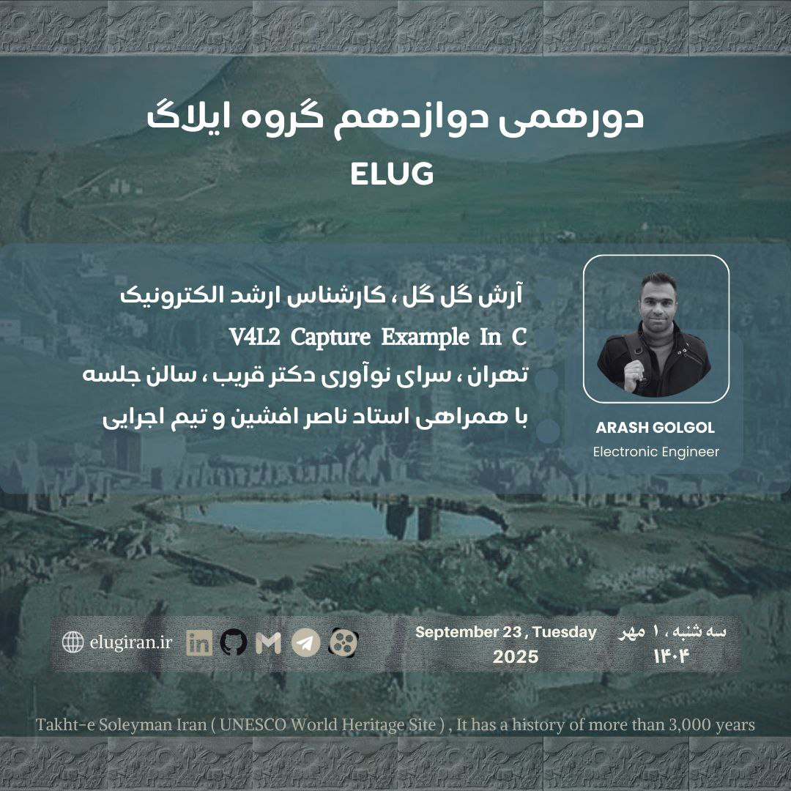

### E-LUG 1404-07

| Title  | Speakers | Slides | Video | C code |
| ------------- | ------------- | ------------- | ------------- | ------------- |
| v4l2 capture example in C | [Arash Golgol](https://github.com/ArashEM) | [PPTX](events/1404/07/documents/v4l2-exmaple-v0.05.pptx) | [Youtube](https://www.youtube.com/@E-LUG_IRAN) - [Aparat](https://www.aparat.com/E_LUG_IRAN) | [C example](events/1404/07/documents/main.c) |

