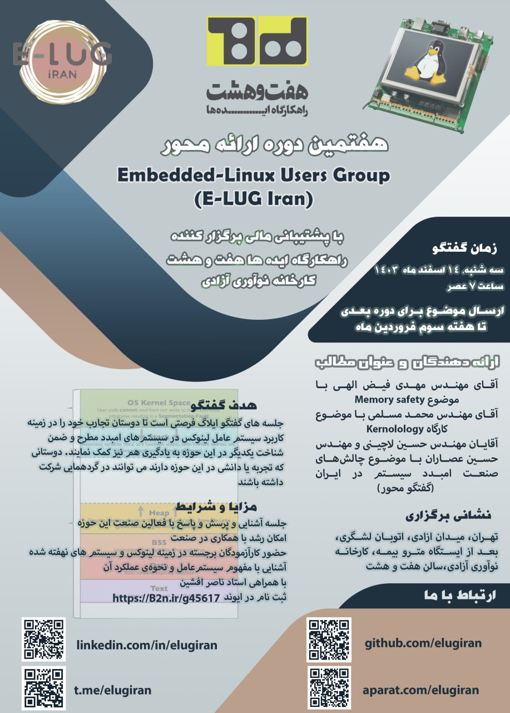

### E-LUG 1403-12

| Title  | Speaker | Slides | Video |
| ------------- | ------------- | ------------- | ------------- |
| Memory Safe | [Mahdi Feyzollahi](https://github.com/mateo-rfz) | [PDF](documents/memory_safe.pdf) - [ODP](documents/memorySafe.odp) | [Youtube](https://www.youtube.com/@E-LUG_IRAN) - [Aparat](https://www.aparat.com/E_LUG_IRAN) |
| Kernelology Memory Management Process Part1 | [M. Moslemi AbarGhan](https://www.linkedin.com/in/mohammad-moslemi-abarghan) | [PDF](documents/Kernelology_Memory_Management_Process_Part1.pdf) - [PPTX](documents/#) | [Youtube](https://www.youtube.com/@E-LUG_IRAN) - [Aparat](https://www.aparat.com/E_LUG_IRAN) |

